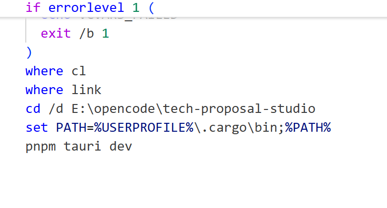

# 江苏远大环境监测实验室信息管理系统技术方案

## 第1章 建设概述

### 1.1 建设背景

淮安市生态环境监测中心实验室信息管理系统始建于2013年，已持续运行13年之久。随着监测业务量不断增长和信息化需求持续提升，原有系统基于过时的技术架构构建，运行速度越来越慢、页面加载延迟、大量数据场景下卡顿明显，已严重制约日常工作效率，导致系统难以充分发挥其应有的业务支撑和质量管理价值。

与此同时，生态环境监测领域新标准、新要求密集出台。《检验检测机构资质认定生态环境监测机构评审补充要求（2025年）》（国市监检测规【2025】4号）已于2026年1月1日起正式施行。该补充要求第十七条明确规定，监测机构应使用信息管理系统对监测全过程进行管理，并采用系统直接采集数据的方式，将实验室信息管理系统（LIMS）从以往的"推荐配置"提升为CMA资质认定的"必备条件"。面对这一硬性合规要求，原有系统因架构限制已无法支撑新标准的全面落地，难以满足新形势下监测业务规范化、信息化的发展需要。

此外，国家大力推进信息技术应用创新（信创）战略，要求关键信息基础设施实现自主可控、安全可靠。现有系统基于老旧技术平台构建，无法兼容国产操作系统、数据库及中间件环境，在信创替代的大趋势下面临严重的技术断层风险，系统的可持续运行和长期发展受到根本性制约。

综合以上因素，迫切需要结合淮安市生态环境监测中心的实际业务需求，对标最新标准规范和信创要求，对系统架构和功能进行全面升级，切实解决运行卡顿、功能滞后、合规性不足、信创不兼容等突出问题，实现监测业务全流程数字化管理、CMA资质合规保障与信创环境平滑适配，全面提升监测中心的信息化水平、质量管理能力和业务运行效率。

### 1.2 建设依据

1、中共中央办公厅国务院办公厅印发《关于深化环境监测改革提高环境监测数据质量的意见》中关于“加快提高环境监测质量监管能力的有关要求”。

2、生态环境部《生态环境监测规划纲要（2020-2035年）》中关于“推动生态环境监测信息化建设”的有关要求。

3、中国环境监测总站《生态环境监测 信息管理系统技术要求（试行）（征求意见稿）》中关于‘环境监测领域对于实验室信息管理系统建设的必要性、强制性及LIMS建设的各项指导要求及意见’。

### 1.3 相关技术标准规范

RB/T 028 实验室信息管理系统管理规范

RB/T 029 检测实验室信息管理系统建设指南

ISO/IEC 17025 检测和校准试验室能力通用要求

RB/T214 检验检测机构资质认定能力评价检验检测机构通用要求

HJ 630 环境监测质量管理技术导则

GB/T8170 数值修约规则与极限数值的表示和判定

GB/T 28035 软件系统验收规范

HJ728环境信息系统测试与验收规范

HJT419环境数据库设计与运行管理规范

### 1.4 服务目标

本次服务的实验室信息综合管理平台具体目标如下：

1．实现监测站政府计划性任务、政府非计划性任务、应急监测、质量控制任务等现有各类监测业务流程化、程序化、标准化、精细化管理，监测要素包括废水、地表水、降水、地下水、噪声、振动、环境空气、废气、土壤、固废等。通过可视化工作流程展示任务完成情况，具有任务超期未完成提醒功能。

2．现场采样可通过移动终端（安卓）完成采样记录功能，填写采样记录，录入现场监测数据，采样人员可现场完成样品录入，选定分析方法，生成采样标签。可通过移动终端实现采样点GPS自动定位、现场拍照和录像、现场数据录入、历史数据查询、手写签名等功能。也可以通过APP实现样品交接确认及样品领取确认。APP拍摄上传的图片可分类管理存储。

3．实现监测站资源全面管理，提升综合管理水平。遵从ISO/IEC 17025标准规范要求，实现与监测质量密切相关的环保局监测站的人（人员）、机（仪器、设备）、料（样品、试剂、标样、标液）、法（方法、评价标准）、环（环境、通讯）的全方位管理，提升综合管理水平。主要包括：人员管理、仪器设备管理、标样试剂管理、文件管理、检测方法管理、检测项目管理、评价标准管理、监测对象管理、分包管理，并且实现各要素间的关联。支持自助一体机配合RFID卡搭配实现用户自助仪器出入库。

4．系统对分析完成的数据设置校核和审核，校核和审核设置电子签名。校核和审核时可查看样品的原始记录、色谱图谱等信息。

5．系统可根据现场和实验室检测结果自动生成各类型报告。并且能够在标准库中选择评价标准，并且能根据系统计算出来的结果进行自动判定是否超标。可以实现监测报告灵活定制，并支持签名。

6．系统应有强大的查询、统计功能，可以实现各种监测信息的查询以及各种数据、工作量的统计。统计都可以按要求导出为各种形式的图表，如Excel、Word等。实现监测站监测业务数据的常规统计与分析，如污染源监测因子分析、污染物超标统计、综合指数计算、质控结果分析与合格率统计等。降低综合信息分析部门的数据分析工作的工作量，提高监测数据的应用效率与准确性。

7．系统具有完整的质量管理功能，可以对采样样品添加现场平行样、全程序空白样、密码样，实验室人员可以对样品添加实验室空白样、实验室平行样、加标样、标样。自动计算相应的质控结果，并进行评价和提醒。所有的退回及修改记录都能够附在最终结果的追溯记录中，以便进行数据溯源。实现各种质控信息的查询和统计报表。可根据质控信息生成质量控制图。

8．系统具有强大的数据对接拓展功能，可实现LIMS与淮安市生态环境监测中心AI实验室的数据对接。LIMS可将监测任务和样品信息推送至AI实验室，AI实验室可将扫码数据以及自动分析后的检测数据推送至LIMS，实现数据闭环。

9．系统可保证数据访问的安全，避免误操作，可供操作过程的全程追溯。保证数据在网络传输过程中的安全，防止出现数据丢失、泄密事故发生。对于需要外网访问，需确保数据传输的安全，确保系统数据库不会受到外来入侵。系统能够满足数据库定时自动备份要求，定期完成数据库逻辑全备份、增量备份、数据库的物理全备份。

### 1.5 [服务原则](#_Toc338934781)

淮安市生态环境监测中心实验室信息综合管理平台本服务方案汲取了其它实验室信息系统建设的经验，结合淮安市生态环境监测中心的实际情况，基于监测站现有信息技术基础上，在技术路线和服务设计上领先全国同行。

本项目设计上主要遵循以下几项原则。

（1）重在整合，优化完善

淮安市生态环境监测中心实验室信息综合管理平台项目应充分利用现有的信息平台业务、功能、组件、插件及信息资源，重点在于数据监测和业务流程的整合，形成一个有机的整体，并在此基础上，进行优化完善。

（2）统一标准、统一规范

服务必须坚持统筹规划、有序推进的原则，克服无序、无规划的盲目实施，以及无标准、低水平的重复投入，在规划的基础上，统一标准与规范，加强标准化和规范化服务。

（3）内容全面、重点突出

服务方案的设计必须站在全局、整体的角度，充分考虑服务交付工作的方方面面，不能有所遗漏。面对服务交付的各项工作，还须突出重点，抓住主要矛盾，做到纲举目张，从局部的重点出发，最终覆盖到整体。

（4）信息共享、增强服务

实验室信息综合管理平台服务应能促进上下级之间、部门之间、科室之间的信息交流和共享；服务成果在符合信息安全和保密管理相应规定的前提下提供给其它部门，促进信息公开和政务公开；增强服务意识，更好地为公众和企业提供环境监测信息和服务。
## 第2章 服内容

本项目提供“淮安市生态环境监测中心实验室信息综合管理平台项目”的全链条服务，采用“购买服务”模式，在三年服务周期内分三个阶段完成。服务内容涵盖软件平台服务、实施交付及运行保障服务两大类别，通过集约化服务架构，实现淮安市生态环境监测中心生态环境监测业务的标准化运行。

### 2.1 服务模式与服务周期

本项目采用“购买服务，保障使用”的服务模式。

#### 2.1.1 服务模式说明

本项目不以传统的“项目建设”方式运作，而是采用“购买服务”模式。系统由淮安市生态环境监测中心向服务提供商购买‘实验室信息综合管理平台’服务后即可开始使用，服务期限定为3年。

第一期（第1年）——升级上线，磨合使用阶段：承建方完成平台全部子系统及配套软硬件的开发、部署、基础数据初始化及上线工作，并配套开展数据资源治理入库、仪器数据采集接入、实施培训及技术支持等服务，淮安市生态环境监测中心能使用平台。

第二期（第2年）——深入使用阶段：承建方提供对全部上线的子系统及模块提供运行支撑和保障工作，包括为用户提供系统操作指导培训、服务器巡检、日常问题处理、技术咨询、操作指导、突发事件应急响应保障、合理功能优化；促进淮安市生态环境监测中心与LIMS平台的进一步深入融合。

第三期（第3年）——全面覆盖阶段：承建方持续提供LIMS全部子系统及模块的运行支撑和保障工作，如系统操作指导培训、服务器巡检、日常问题处理、技术咨询、操作指导、突发事件应急响应保障、合理功能优化；持续保障监测中心的LIMS平台使用。

#### 2.1.2 服务周期与覆盖范围

本项目整体服务周期为36个月，自202X年X月起至202X年X月止。各阶段覆盖范围与服务内容如下：

|   |   |   |   |
|---|---|---|---|
|阶段|时间周期|覆盖范围|核心服务内容|
|第一期|第1年|实验室信息综合管理平台全部子系统模块|完成平台版本升级及全部子系统开发和上线工作，完成用户培训、硬件交付、平台试运行及验收，确保淮安监测中心各科室用户能够掌握LIMS平台的使用|
|第二期|第2年|实验室信息综合管理平台全部子系统模块|提供操作指导培训、服务器巡检、日常问题处理、技术咨询、操作指导、突发事件应急响应保障、合理功能优化服务，促进监测中心对LIMS的深入使用及融合|
|第三期|第3年|实验室信息综合管理平台全部子系统模块|提供操作指导培训、服务器巡检、日常问题处理、技术咨询、操作指导、突发事件应急响应保障、合理功能优化服务，保障LIMS对淮安监测中心的业务全方位深度覆盖|

#### 2.1.3 服务边界说明

本项目的3年期限内，服务范围明确界定如下：

纳入服务范围：软件平台使用服务、实施交付服务（含基础数据采集与标准化治理、模板配置、仪器数据采集接入、AI实验室对接、系统初始化配置）、运维保障服务（含培训服务、现场支撑保障、系统运行保障）。平台升级配套采购的硬件设备（服务器、移动标签打印机、移动终端）享受硬件供应商质保。

不纳入服务范围：基础网络及安全资源由淮安市生态环境监测中心提供，相关费用不计入本项目服务费。信息化终端设备（办公电脑）由监测中心自行保障。

### 2.2 服务包构成

本项目服务内容由两大服务包构成，分别为：软件平台服务、实施交付及运行保障服务。各服务包之间紧密协同，共同构成覆盖“部署—交付—保障使用”全链条的一体化服务体系。服务包构成如下：

|   |   |   |
|---|---|---|
|服务包|服务概述|说明|
|服务包一：  软件平台服务|完成实验室信息综合管理平台的部署及上线，上线全部子系统模块及配套采购硬件的安装部署，协助完成基础数据整理导入、采集接入、用户培训等服务，并支撑监测中心各科室使用。|保障全部子系统模块完成上线和试运行工作；协助推进LIMS全部软硬件部分功能确认，完成功能上线验收确认|
|服务包二：  实施交付及运行保障服务|保障监测中心对LIMS的深入使用，完成平台全部子系统模块及招标配套的硬件设备交付确认；提供用户培训、服务器巡检，系统缺陷问题处理等的平台运行保障服务|保障全部子系统上线后的稳定运行，提供系统运行时的各项运行维护工作|

说明：具体服务内容详见第三、四、五章节。

### 2.3 服务范围

本项目服务范围以‘淮安市生态环境监测中心实验室信息综合管理平台项目’的服务内容为基准，提供仅限于平台服务涉及的软件部分及硬件部分服务。其中：

软件部分服务内容：

|   |   |   |   |
|---|---|---|---|
|实验室信息综合管理平台|   |数量|备注|
|1|监测业务管理子系统|1套||
|2|实验室资源管理子系统|1套||
|3|监测业务基础信息子系统|1套||
|4|质量控制管理子系统|1套||
|5|统计管理子系统|1套||
|6|现场电子记录单管理子系统|1套||
|7|实验室电子记录单管理子系统|1套||
|8|移动现场监测子系统|1套||
|9|电子签名子系统|1套||
|10|分析仪器数据采集子系统|1套||
|11|AI实验室对接|1套||
|12|仪器智能出入库|1套||
|13|水质数据融合|1套||

硬件部分：

|   |   |   |
|---|---|---|
|序号|设备名称|数量|
|1|服务器|1或2 台|
|2|移动终端|4台|
|3|移动标签打印机|4台|
|4|仪器智能出入库一体机|1套|

。
## 第3章 服务包一：软件平台服务

### 3.1 平台系统架构

#### 3.1.1 总体架构

淮安市生态环境监测中心实验室信息综合管理平台，总体架构自下而上分为：数据采集层、数据层、应用层和表示层，合计4个层次，各层之间通过标准接口进行交互，形成“厚底座、轻应用、强协同”的一体化技术架构

总体架构如下图所示：

 

系统总体架构示意图

1）数据采集层：系统支持与仪器及AI实验室进行无缝衔接，自动采集与处理监测分析数据，针对无法采集的实验数据，由实验人员手工进行数据录入。支持通过一体机实现仪器设备出入库。

2）数据层：指用于存放业务的数据库。通过系统集成，能够实现与监测站现有其他信息系统进行数据的交互。

3）应用层：本次部署的实验室信息综合管理平台（LIMS），应用该系统实现各种类型的监测业务管理、全面资源管理、基础数据管理和质量控制和质量保证管理等。并给领导层和需要查询数据的用户提供数据查询平台。

4）表示层：是客户端用户应用各种浏览器登录系统，通过用户名、密码、部门、角色等权限进行验证。

#### 3.1.2 应用架构

平台应用架构以LIMS数字实验室为核心，围绕生态环境监测全流程业务进行模块化设计，构建覆盖淮安地区的一体化实验室信息管理系统。各功能模块既相对独立又相互协同，共同支撑淮安LIMS生态环境监测工作的信息化管理。

应用架构如下图所示：

 

实验室信息综合管理平台功能架构示意图

#### 3.1.3 网络架构

系统部署于淮安市生态环境监测中心内部机房的实体服务器，服务器为本次平台升级所采购，系统运行所需其他资源及设备（包括存储资源、网络资源、安全资源、计算资源等）均由淮安市生态环境监测中心。网络拓扑结构如下：

 

系统部署架构示意图

1）系统采用B/S架构，应用政务外网，来为监测中心建立一个统一的实验室信息综合管理平台。通过为每一用户进行正确的授权，可以使其只能访问各自权限范围内的内容，对于管理人员，将可浏览到监测站的所有的科室的监测业务信息。

2）为保障将来实验室信息综合管理平台对数据可靠性和安全性的要求，保证7x24小时不间断运行，本次系统升级使用的服务器硬件需满足信创要求。

3）对监测中心领导、管理层、监测技术人员等任意用户，客户机不需要安装实验室信息综合管理平台软件，全部操作和应用都通过WEB浏览器方式完成，包括进行监测任务受理、委派、采样、样品受理、任务接收、任务分配、结果录入、仪器自动采集、报告审核、报告签发，并实现仪器、人员、文件、材料等多种资源全部实现管理。

### 3.2 生态环境监测中心实验室信息综合管理平台

淮安市生态环境监测中心实验室信息综合管理平台项目的升级服务方案汲取了其它实验室信息系统建设的经验，结合淮安市生态环境监测中心的实际情况，基于监测站现有信息技术基础上，在技术线路和设计思路上领先全国同行。

实现生态环境监测业务的标准化、流程化与信息化管理，全面覆盖业务委托、监测方案制定、现场采样、样品流转、实验室分析、数据审核、报告编制与签发等监测业务全流程。系统设计紧密结合淮安市生态环境监测中心的实际工作需求，全面支撑环境监测工作的全流程闭环管理，提升监测质量和管理效率。

本次系统将以升级的JAVA  LIMS框架为基底，涵盖监测业务管理子系统、实验室资源管理子系统、监测业务基础信息子系统、质量控制管理子系统、统计管理子系统、现场电子记录单管理子系统、实验室电子记录单管理子系统、移动现场监测子系统、电子签名子系统、分析仪器数据采集子系统、AI实验室对接、智能仪器出入库及水质数据融合合计十三大核心功能模块。各功能模块既相对独立又相互协同，紧扣生态环境监测“人、机、料、法、环、测”全要素管理要求，形成“业务流、数据流、管理流”三流合一的数字化治理体系。

#### 3.2.1 系统功能架构升级

淮安市生态环境监测中心实验室信息综合管理平台是在网络硬件平台支撑的基础上，形成了多层次功能框架。

提供基于JAVA开发技术的合理的技术路线、功能融合架构设计，采用B/S构架，局域网运行模式，通过内网络使用本系统，也可以通过公网访问本系统，并根据权限进行操作。能够兼容通用主流浏览器（至少包括谷歌浏览器、360浏览器）

#### 3.2.2 技术架构

JAVA+SpringCloud+SpringBoot的开发框架进行研发，前端采用VUE+Node,js的流行框架进行研发，采用前后端分离，接口RESTFUL风格进行定义。采用的Spring Cloud是基于SpringBoot 提供的一套微服务解决方案，包括服务注册与发现，配置中心，全链路监控，服务网关，负载均衡，熔断器等组件。Spring Cloud利用SpringBoot的开发便利性巧妙的简化了分布式系统基础设施的开发，Spring Cloud为开发人员提供了快速构建分布式系统的一些工具，包括配置管理、服务发现、断路器、路由、微代理、事件总线、全局锁、决策竞选、分布式会话等。它们都可以用SpringBoot的开发风格做到一键启动和部署。微服务架构是 SOA 架构思想的一种扩展，更加强调服务个体的独立性、拆分粒度更小。可以更精准的制定优化服务方案，提高系统的可维护性。

#### 3.2.3 高性能缓存技术

Redis是一个基于 key-value 键值对的持久化数据库存储系统。支持多种数据结构，支持数据的持久化，可以将内存中的数据保存在磁盘中，重启的时候可以再次加载进行使用。读的性能可达到110000次/s,写的性能81000次/s，支持集群扩展，支持主从模式。

采用Redis作为高性能缓存和队列技术，实现Web系统缓存，实现通讯存储服务的数据处理队列和数据存储写入缓存，应用于存储使用频繁的数据，减轻服务器负载、降低网络拥塞，减少客户访问延迟，提高反应速度、性能、减少磁盘读写提升系统访问性能。

#### 3.2.4 先进的报表技术

采用先进的报表技术，通过Aspose组件，基于Excel、Word制作个性化报表，充分满足用户报表扩展行、扩展列、交叉数据、多表页等特点，并支持图片、兼容电子签名等特色，满足实验室各类报表格式要求。

#### 3.2.5 工作流引擎

通过工作流引擎提供根据角色、分工和条件的不同，决定信息传递路由、内容等级等核心解决方案，用户可以自定义配置流程，使流程更个性化。

#### 3.2.6 监测业务管理子系统

业务管理模块应结合环境监测行业的技术规范和淮安市生态环境监测中心的实际工作，针对不同的监测业务类型，实现监测业务全过程的信息化和自动化。

将传统的手头流动的项目委托工作流程，转换成网络化办公。实现任务的流程化管理。此模块，统筹规范实验室内各部门用户实现从接样、到样品分析、数据录入、数据复核，分析报告审批等工作流程；可实现从项目检测方案到样品的无痕转换，从而实现从信息流到数据流的转换，将实现信息最大化使用，进一步规范化实验室工作流程。

 

实验室信息管理系统首页

#### 3.2.7 监测业务登记（任务登记）

可按承接任务的来源、性质、监测要素、承接/下达任务的时间进行分类管理。任务承接人接到任务后按任务分类在系统中进行登记，主要记录监测类别、企业名称、地址（含所在区域）、联系人、电话等，监测点的经纬度、排口信息等。如果是新客户则点击新客户，添加新的客户信息，如果是老客户，在系统中有相应记录，通过输入客户名称进行查询，得到客户基本信息等。

#### 3.2.8 安排任务

在监测业务承接后，相关科室的领导层可以查看监测业务信息，并利用系统指派该项任务的项目负责人。

#### 3.2.9 现场踏勘

负责该任务的负责人根据任务的类型决定是否需要去现场，如果需要去现场的，编写现场踏勘的意见和建议，系统能完整保存现场踏勘记录。当现场踏勘达不到验收条件时，可以拒绝，退回任务指派环节。不需进行现场踏勘的，在系统中直接编制监测方案。

由项目负责人根据监测任务的现场情况及委托要求，能够通过系统对监测方案进行详细的编辑，包括采样的点位信息、采样周期与频次、参与监测的分析因子信息,系统根据方案信息自动生成方案。

当项目负责人制定出监测方案后，技术负责人对监测方案，监测方法的周期、频次进行审核。当项目负责人编制监测方案出现错误时，即方案评审不合格时，可以拒绝或退回给项目负责人。

#### 3.2.10 现场采样

系统生成采样瓶标签，采样人员可打印条码标签，现场采样记录单。增加现场平行和现场空白样，并可自动根据配置过滤需要平行或空白的监测项目。

当采样后，发现样品多采和少采可在系统中进行添加和删除。当采样点与实际采样不相符时，通知编制方案人员直接修改方案，避免退回任务带来的重复工作量以及数据的丢失。同时，采样人员可在系统内记录现场采样信息，查看移动端现场记录，并支持现场附件的上传下载，当出现人员临时调整时，支持采样中临时调换采样人。

#### 3.2.11 样品接收

样品管理员进行样品交接。当一个项目一次样品交接完成或多次交接，做到采集来的样品可以马上分析，没有采样的样品还在待接收状态，做到如实反映项目的执行情况。要求系统可记录样品交接详细信息，如采样或送样人、接样人、接样时间、样品状态、是否留样、是否冷藏、是否完备等，并可以形成样品交接记录。

#### 3.2.12 分配任务

样品接收后，系统应能自动将任务分配到分析测试相关岗位人员，并进行样品领取，科室主任可手动调整各检测项目使用方法和检测人员，如果检测人员上岗证过期，应予以提示，无法进行样品领取。

#### 3.2.13 数据录入

支持分析人员按分析工作建立工作单、 录入分析数据、填写实验室环境及所用仪器设备，并指定实验室复核人复核数据工作。

对于需要做工作曲线的监测方法，要求系统能够根据所添加的标样自动生成校准曲线，并计算斜率、截距和相关系数，并自动参与下一次样品的浓度计算直到新的校准曲线产生。

实验室录入支持各项指标的计算公式配置，实验室人员可通过配置录入相关参数数据，系统根据公式可自动计算除最终检测数据，对于烟气类样品，系统可自动根据公式采集现场人员录入的样品信息参数，如采气体积、气温、气压、氧含量等，并进行自动计算或折算。能够自动获取大型仪器设备和AI实验室分析后的结果数据。

应能够根据方法和质控的要求，在样品列表内添加各项质控记录，实验室质控记录包括：实验室空白、实验室平行、曲线校核点、质控样、加标回收样等，质控记录的评判标准应可以根据不同的项目和方法中的具体要求事先录入系统并保存，如果质控结果不满足评价标准，系统具有提醒报警功能。

#### 3.2.14 数据审核

可对分析完成的数据行复核、数据确认和审核，并支持电子签名。

数据复核：实验室分析流程结束后系统会自动进入下一审核流程，此时复核人员收到提醒后对分析人员手工记录本数据和系统中录入数据进行核对确认的复核流程；

数据确认：对送样单中数据都录入并复核完毕后，确认分析数据，确认现场数据，退回个别错误数据要求重新确认填写；也可退回要求复验，系统提供数据复验功能，实验室人员重新进行数据录入，并可在数据确认中确认最终出证结果。

退回应注明原因，做到全程留痕。

#### 3.2.15 报告编制签发

系统应根据环境监测中心的要求，能辅助生成报告编号及相关电子报告，提供报告的转交编制功能及数据追溯查询功能，编制报告时可灵活调阅查看关联的数据、附件等内容。

报告提交后可根据工作流配置自动发送至相关具备审核权限的人员处进行报告审核、签发，并可退回报告并记录相关审核签发意见，以便追溯。

#### 3.2.16 报告归档

要求能打印授权签字人审核通过的报告，提交给相关的管理部门，对报告领取人、领取时间进行记录。

#### 3.2.17 实验室资源管理子系统

#### 3.2.18 人员管理

应能对环境监测中心人员的档案信息进行管理。增加、删除工作人员，设立权限查询，可将人员的简历动态更新。

要求对环境监测中心人员上岗证进行管理，并可以对上岗证检测项目进行管理。当上岗证即将过期时，应能够及时预警提示。

#### 3.2.19 评价标准管理

进入系统管理的评价标准包括国家标准、环保行业内在用标准，以及其它行业的参照标准。可执行不同项目对照不同标准分别进行评价。

#### 3.2.20 文件管理

需提供创建、存储、查询和共享各类文档，包括：程序文件、质量手册、作业指导书、记录表格、管理制度、标准、方法等。

#### 3.2.21 档案管理

可对档案进行案卷分类，支持对档案进行上传、下载，可以设置档案权限，并可根据检索条件，检索匹配的档案信息。

#### 3.2.22 方法标准管理

可对环境监测中心具备的所有检测能力进行管理，包括尚未通过《实验室资质认定评审准则》和《检测/校准实验室能力认可准则》（CNAS-CL01:2006）认证/认可的分析方法。

#### 3.2.23 监测对象管理

可维护对业务相关的监测对象资料，包括例行监测（环境质量、重点污染源等）、受检企业的名称、地址、联系方式、联系人等基本信息。

#### 3.2.24 客户管理

对环境监测中心各类委托的客户进行信息登记，包括企业名称、法人、组织机构代码、企业类型、联系人、联系方式、地址等基本信息。

#### 3.2.25 供应商管理

能对供应商进行统一管理，包括供应商名称、联系人、联系方式、资质、供应货品及服务评价等信息。

#### 3.2.26 消耗品管理

应能分类管理试剂、耗材和标准品，能查看各消耗品的信息，如名称、规格、库存等。能对消耗品进行日常管理，支持库存查询，实时反映消耗品库存状态。可以设置报警条件，当消耗品库存低于报警值时必须及时预警，当消耗品过期或即将过期时，应能够及时预警。对于领取的消耗品能够记录消耗品领用人、领用时间、领用数量、领用原因备注等。

#### 3.2.27 标准溶液配制管理

实验室人员能够维护标准溶液配值信息，能够记录配制过程、配制日期、试剂规格等信息。

#### 3.2.28 仪器设备管理

应能维护仪器设备的基本信息、维修维护、设备检定、使用信息、出入库信息等履历信息。包括仪器设备的基本信息如仪器名称、制造厂商、销售商、价格、内部编号、购置时间、最近检定时间、检定周期、检定结果、检定单位、维护人员、维护内容、备注等。

需能自动生成相对应的仪器使用维护记录。根据仪器设备的检定计划、期间检查计划提醒用户确保仪器的状态正常，避免仪器超期使用。能够进行检定校准记录信息的填写，并自动更新仪器有效期，能够维护期间核查信息，并支持上传仪器附件。

支持仪器设备出入库信息记录，并与仪器智能出入库设备实现信息对接。

#### 3.2.29 监测业务基础信息子系统

1)  应能配置污染源信息，配置企业及监测点位信息，设置评价标准及要求，流程中可以根据该配置自动生成监测方案。

2)  应能配置河流、断面信息，设置监测方案及频次（包括点位、任务计划、相关测试项目、相关点位等配置），设置评价标准及要求，流程中可以根据该配置自动生成监测方案。

3)  应能配置本机构开展的任务类型、采用的流程、任务编号规则等信息。

4)  应能配置各类样品类型基本信息，包括样品类型名称、分析项目模板、样品分组设置等。

5)  应能通过工作流引擎界面化配置各类工作流，设置流程参数。

6)  应能配置测试对应的公式计算逻辑及参数配置，实现自动计算。

7)  应能设置报表模版和报表生成规则。

8)  应能设置编号规则，包括样品编号规则、质控样编号规则、报告编号规则等。

#### 3.2.30 质量控制管理子系统

#### 3.2.31 质控考核

质控人员能够根据实验室的需要，下达质控考核任务。包括：实验室比对、能力验证、人员比对、方法比对、仪器比对、标样考核、盲样考核等。质控考核以任务单的形式流转至实验室分析环节，系统自动汇总数据结果，质量管理人员可对质控结果进行分析汇总评价。

#### 3.2.32 数据质控

可设置质控评价标准要求，并根据质控样品类型自动计算相对误差、偏差、加标回收率，并对质控样品进行自动评价，当数据不满足评价要求时，可自动提醒分析人员。

#### 3.2.33 质控样品统计

要求可以对采样样品添加现场平行样、全程序空白样，实验室人员可以对样品添加实验室空白样、实验室平行样、加标样、标样。检测人员将质控样品数据录入系统，系统根据质控限值标准自动计算相应的质控结果。

#### 3.2.34 质控分析统计

可查询空白样质控、平行样质控、加标样、质控样样品信息，统计质控数据。统计信息包括分析项目、分析人员、现场采样数、质控样品数、检查数、检查率、合格数、合格率等内容。

#### 3.2.35 统计管理子系统

对实验室的各种信息进行统计分析，包括监测样品、数据、归档报告、工作量等。并根据指定时间、区域/企业、指定监测项目等筛选条件自动汇总生成监测数据统计报表。

#### 3.2.36 项目进度查询

实时呈现项目信息及项目所处状态，能够根据项目信息内关键字进行模糊查询项目详情，项目详情主要包括委托信息、方案信息、样品信息、数据信息、报告信息等，同时可以生成监测任务台账。

#### 3.2.37 样品数据查询

可以按照时间、样品编号、送样单号、样品状态等条件搜索样品，查看样品相关的所有信息，包括分析人员、分析时间、复核人员、复核时间，样品状态，数据状态，同时可查看样品的交接、领取记录。

#### 3.2.38 送样单查询

能够根据样品编号、送样单号、委托单位、受检单位等条件查询送样单信息及送样单下相关样品检测状态。

#### 3.2.39 数据查询

可根据检索条件，如采样起始时间、项目名称、委托单位、样品类型、受检单位、采样地点模糊查询选定时间内监测任务的数据，如统计污染源某点位年内所有监测数据等。

#### 3.2.40 项目数量统计

可以统计任意时间段内各类委托数量及样品数量。

#### 3.2.41 归档报告查询

可查询监测工作流转完成后的归档报告信息，实现对检测报告的分类管理，根据报告类型，任务名称，委托单位进行查询归档报告。

#### 3.2.42 人员工作量统计

配置各分析环节及分析监测项目的工作量，可以统计任意时间段内每个工作人员的工作量统计及明细，也可以统计每个分析项目的工作量情况及信息；实时统计出环境监测中心人员工作产出。

#### 3.2.43 现场电子记录单管理子系统

系统支持现场采样电子原始记录单生成、并且结合图片签名进行表单无纸化流转。

支持监测站现场各类电子原始记录单生成，采样人员可以在录入基本信息后，自动生成对应的采样记录单，其中应包括样品编号、点位名称、受检单位、采样日期、采样时间、现场监测信息（如：风速、风向、标杆排气量等）、样品信息（如：样品外观、样品性状等）以及现场监测数据内容（如：pH值、溶解氧等）。保证了电子原始记录单数据的安全性、完整性等要求。

现场电子记录单应包括以下内容：

|   |   |
|---|---|
|序号|原始记录表名称|
|1|地表水采样记录表（双页）|
|2|地下水采样记录表（双页）|
|3|水环境现场测定记录表|
|4|污水采样记录表（pH）|
|5|排污单位现场监测调查表|
|6|污水采样记录表|
|7|底泥采样记录表|
|8|环境空气被动采样记录表|
|9|烟尘（颗粒物）、废气参数现场监测原始记录|
|10|气态污染物仪器法现场监测原始记录|
|11|大气降水采样现场记录表|
|12|工业废气现场记录|
|13|烟气在线比对监测现场记录表|
|14|环境空气现场采样记录表|
|15|土壤样品采样记录表|
|16|土壤交接表|

#### 3.2.44 实验室电子记录单管理子系统

系统支持实验室电子原始记录单生成，并且结合图片签名进行表单无纸化流转。

实验室电子原始记录单可自动绑定检测项目及标准方法、实验过程中的环境、使用仪器（含仪器型号、编号、检定和校准有效期）、前处理信息、运用的校准曲线、标定记录、标准溶液配制记录、分析过程中包括仪器自动采集的检测数据及最终结果、质控样信息等多方面数据，同时保证原始记录单审核路径、数据安全、完整性、操作记录等要求。

实验室原始记录单：

|   |   |
|---|---|
|序号|表单名称|
|1|电感耦合等离子体光谱法原始记录|
|2|气相色谱质谱分析原始记录表（土壤）|
|3|气相色谱/质谱分析原始记录表|
|4|分光光度法测定土壤项目原始记录表|
|5|色谱原始记录表（大气）|
|6|液相色谱分析原始记录表|
|7|色度分析原始记录表|
|8|电导率分析原始记录表|
|9|生化需氧量(BOD5)分析原始记录表|
|10|容量法分析原始记录表-高浓度|
|11|等离子发射光谱分析记录表|
|12|容量法分析原始记录表（土壤）|
|13|原子吸收分光光度法原始记录（火焰法）|
|14|蚕豆根尖微核监测记录簿|
|15|色谱原始记录表|
|16|粪大肠菌群原始记录表|
|17|固定污染源废气|
|18|四乙基铅分析原始记录表|
|19|容量法分析原始记录表（高锰酸盐）|
|20|容量法分析原始记录表-低浓度|
|21|电感耦合等离子体质谱法原始记录|
|22|容量法分析原始记录表（硫化物）|
|23|流动注射法分析原始记录簿|
|24|石油类紫外分析记录表|
|25|离子选择电极法分析原始记录表|
|26|pH分析原始记录表(土壤)|
|27|电感耦合等离子体光谱法原始记录（空气）|
|28|紫外可见分光光度法分析原始记录表|
|29|重量法分析原始记录表|
|30|原子吸收分光光度法原始记录（石墨炉法）|
|31|土壤波长色散X荧光光谱法原始记录|
|32|酶底物法原始记录单|
|33|余氯分析原始记录表|
|34|冷原子吸收荧光法分析原始记录表|
|35|油类分析原始记录表|
|36|pH分析原始记录表|
|37|土壤水分含量测定原始记录表|
|38|一氧化碳分析原始记录表|
|39|原子吸收分光光度法原始记录（石墨炉法）（土壤）|
|40|非分散红外吸收法原始记录表|
|41|容量法分析原始记录表（GB9834）|
|42|叶绿素分记录簿|
|43|原子吸收分光光度法原始记录（火焰法土壤）|
|44|COD地表水分析原始记录表|
|45|重量法分析原始记录表（颗粒物）|
|46|重量法分析原始记录表（降尘）|
|47|分光光度分析原始记录表（无组织废气）|
|48|冷原子吸收荧光法分析原始记录表(土壤-汞）|
|49|离子色谱原始记录表|
|50|分光光度分析原始记录单（环境空气）|
|51|浊度原始记录表|
|52|细菌总数、总大肠菌群、粪大肠菌群原始记录表|
|53|浮游植物分析记录簿|
|54|原子吸收分光光度法原始记录（火焰法-固废）|
|55|冷原子吸收荧光法分析原始记录表(土壤）|
|56|容量法分析原始记录表（氯化物）|
|57|分光光度分析原始记录表|
|58|容量法分析原始记录表（土壤全氮）|
|59|煤含硫量分析原始记录表|
|60|分光光度分析原始记录表（土壤总磷）|
|61|容量法分析原始记录表|
|62|发光菌急性毒性试验记录簿|

#### 3.2.45 移动现场监测子系统

#### 3.2.46 项目流程类任务管理

针对项目负责人已事先在平台编制好方案的任务，现场监测人员可使用移动终端进行现场采样工作。

现场监测人员可在通过移动终端下载平台端下发的监测任务，查看现场监测任务的相关样品信息，按采样安排和现场的实际情况，确认要采集的样品清单，现场建立采样单，并可增加相关质控样，可通过移动标签打印机现场打印样品标签，并与LIMS平台实时交互信息，避免编号重复问题，然后进行样品采集工作。

 

采样点位

#### 3.2.47 应急类任务管理

针对应急类监测任务，现场监测人员到达现场后，可根据现场环境和监测要求，确认监测信息后，可直接通过移动端现场登记任务详情，包括任务信息、相关采样样品信息、检测指标等信息，并实时同步到LIMS系统。

#### 3.2.48 现场数据记录

移动端可根据现场监测人员登记的样品信息，记录现场监测数据、使用仪器和环境信息，并获取采样点经纬度信息，对现场情况进行拍照、拍摄的功能，用户可自由设定照片拍摄的类别。信息确认无误后，实时同步到LIMS平台，达到现场证据链的过程记录。

 

现场记录

 

经纬度、采样拍照

#### 3.2.49 样品扫码交接

样品管理员可以在APP上实现样品的扫码交接。打开后将列表化展示送样单及单内全部的样品，样品将以分组的形式进行展示。样品管理员通过扫描样品标签上的二维码，进行扫码交接，记录接样人、接样时间和样品的冷藏/完备情况，并更新样品扫码交接状态。

 

#### 3.2.50 样品领取

实验分析人员可以在APP上实现样品领取。可通过检索条件查询待领取样品，可实现样品分组的快速领取，支持批量领取样品。

 

#### 3.2.51 数据查询

移动端应支持查看历史数据信息，根据项目编号、项目名称、受检单位等条件查询历史记录，包括：项目信息、采样单信息、样品数据信息，方便现场监测人员及时掌握现场监测点位动态。

#### 3.2.52 电子签名子系统

电子签名功能，要求在WORD、EXCEL表单文件上实现图片格式的电子签名，将电子签名与各种文档捆绑在一起或进行关联，主要应用于实验室电子原始记录单、电子报告流转，用户可通过实验室信息管理系统对报告进行编制、审核、签发流程，实现真正意义上的无纸化办公。

#### 3.2.53 分析仪器数据采集子系统

将仪器产生的数据（可以是仪器数据文件，也可以是数据库）采集到实验室管理系统中，存储为原始记录并根据需要生成报告，减少数据录入工作量和避免录入时产生的误差，提高工作效率。

系统支持与仪器进行无缝衔接，自动采集与处理监测分析数据。此部分主要包括如下功能：与仪器进行连接，实现监测分析数据的自动采集；保存采集日志，便于核对；系统自动对已采集到的检测信息进行筛选、过滤，提取有效信息。

系统支持各类大型分析仪器，举例如下：

|   |   |   |   |
|---|---|---|---|
|序号|设备名称|规格型号|生产厂商|
|1|TOC|TOC-Vcph|日本岛津公司|
|2|COD自动滴定分析仪|905 Titrando|瑞士万通（Metrohm)公司|
|3|测汞仪|MA-2|日本NIC|
|4|等离子发射质谱仪|XSeries|美国热电|
|5|电感耦合等离子体发射光谱仪ICP-OES|ICP-8000|珀金埃尔默仪器（上海）有限公司|
|6|电感耦合等离体质谱仪（ICPMS）|Agilent7900|美国安捷伦公司|
|7|电感耦合等离子光谱|7300DV|美国Thermo公司|
|8|电感耦合等离子光谱|7400D|美国Thermo公司|
|9|电感耦合等离子光谱|PQ9000|德国jena|
|10|高效液相色谱仪|1200|美国安捷伦公司|
|11|红外测油仪|JDS-106U|天津金贝尔|
|12|红外测油仪|OL1010|昂林|
|13|红外分光测油仪|JDS-150U+|吉林市北光分析仪器厂|
|14|红外光度测油仪|JDS-105U|吉林市北光分析仪器厂|
|15|火焰原子吸收分光光度计|AA240|美国瓦里安公司|
|16|库仑测硫仪|CLS-5A||
|17|崂应3012H|3012H|青岛崂应|
|18|微电脑烟尘平行采样器|TH-880F|武汉市天虹智能仪表厂|
|19|离子色谱|ICS-1000|戴安公司|
|20|离子色谱|ICS-90|戴安公司|
|21|离子色谱仪|HIC-10A|日本岛津公司|
|22|离子色谱仪|ICS-1500|DIONEX|
|23|离子色谱仪|ICS-2000|美国戴安公司|
|24|离子色谱仪|ICS-2100|美国戴安公司|
|25|连续流动分析仪|5000|荷兰SKALAR|
|26|流动注射自动分析仪|SAN++|SKALAR|
|27|流动注射自动分析仪|AAA+|德国D＆L公司|
|28|气相分子吸收光谱仪|GMA3370|安捷伦|
|29|气相分子吸收光谱仪|GMA3201|上海北裕环保科技有限公司|
|30|气相分子仪|AJ-2100|上海安杰环保科技有限公司|
|31|气相色谱仪|6890N|安捷伦公司|
|32|气相色谱仪|7683B|美国安捷伦公司|
|33|气相色谱仪|7820A|美国Agilent公司|
|34|气相色谱仪|7890A|安捷伦公司|
|35|气相色谱仪|7683|美国安捷伦公司|
|36|气相色谱仪|GC2010|日本岛津公司|
|37|气相色谱仪|GC2014|日本岛津公司|
|38|气相色谱仪|Varian CP-3800|美国Varian公司|
|39|气相色谱-质谱联用|7890 GC|美国安捷伦公司|
|40|气相色谱-质谱联用|DSQ|美国 Thermo|
|41|气相色谱-质谱联用系统|DSQ-Ⅱ|美国 Thermo|
|42|气相色谱-质谱联用仪|7890A-7000B|安捷伦公司|
|43|气象色谱仪|GC-9160|上海欧华分析仪器厂|
|44|熱脱附-气相色谱|GC580-ATD650|珀金埃尔默仪器（上海）有限公司（PE）|
|45|双道原子荧光光度计|AFS-830|北京吉大小天鹅仪器公司|
|46|原子吸收|AA6800F|日本岛津公司|
|47|原子吸收|SOLAARS4|美国Thermo公司|
|48|原子吸收|Thermo M6|美国Thermo公司|
|49|thermo|TCE3500|美国Thermo公司|
|50|原子吸收分光光度计|240FS|美国Agilent|
|51|原子吸收分光光度计|240Z|美国Agilent|
|52|原子吸收分光光度计|AA220E|美国瓦里安公司|
|53|原子吸收分光光度计|AA240FS|美国瓦里安公司|
|54|原子吸收分光光度计|analytik jena|德国jena|
|55|原子荧光光度计|AFS200T|江苏天瑞仪器股份有限公司|
|56|原子荧光光度计|AFS-933|北京吉天仪器有限公司|
|57|原子荧光光度计|AFS-9130|北京吉天仪器有限公司|
|58|原子荧光光度计|AFS-9700|北京海光仪器公司|
|59|原子荧光光度计|RGF-6200|北京博晖创新|
|60|紫外可见分光光度计|TU～1810PC|北京普析通用仪器有限责任公司|
|61|紫外可见分光光度计|TU～1900|北京普析通用仪器有限责任公司|
|62|紫外可见分光光度计|TU～1901|北京普析通用仪器有限责任公司|

#### 3.2.54 AI实验室对接

    将LIMS平台与淮安监测中心AI无人实验室完成数据对接。由LIMS平台产生样品编号及检测项目，由AI无人实验室负责数据分析，最终LIMS平台获取相关检测结果数据，实现数据自动分析、自动获取、自动匹配。

 

#### 3.2.55 智能仪器出入库

打通智能仪器出入库接口，实现一体机与LIMS的数据互通，用户可完成仪器设备的自行出入库。

现场仪器设备张贴RFID标签。在仪器间门口放置一体机，具备人脸识别、射频标签识别、报警装置，通过一体机桌面级应用实现仪器领用、仪器归还、仪器送检操作，通过人脸识别、标签识别，实现快捷操作。如未登记，触发报警装置。通过仪器出入库管理可以为现场仪器的规范化管理，同时与LIMS打通实现仪器设备出入库信息内容的数据对接。

#### 3.2.56 水质数据融合

提供水质数据融合的模块，针对水质监测点位，可实现手工检测数据及水质自动站的月均值数据的深度融合，手工检测数据可自动同步LIMS中例行点位的每月检测数据，水质自动站的数据则可通过数据导入的形式实现录入。

通过两者汇总的数据及配套计算逻辑最终可判定点位水质类别及超标情况，相关判定结果支持特定格式的表格导出。

#### 3.2.57 配套采购硬件

本次LIMS平台上线配套硬件为服务器、移动标签打印机及移动终端。

|   |   |   |   |
|---|---|---|---|
|序号|设备名称|技术参数（至少达到以下要求）|备注|
|1|服务器  1或2台|处理器：2.4G，16C/32T,10.4GT/s，24M缓存  内存：32GB  硬盘：1.2TB  操作系统：linux  数据库： mysql||
|2|移动标签打印机  4台|打印行宽:≥72mm;  打印方式:热转印/热敏  装纸类型:推键装纸  数据通讯接口:串口RS232蓝牙  切纸方式:手切纸||
|3|移动终端  4台|前置摄像头：≥ 800万  后置摄像头：≥1300万  内存容量：≥128G  内存：≥6G  尺寸：≥10.4英寸  连接方式：4G、蓝牙、WIFI||

#### 3.2.58 品牌型号推荐

ü 服务器

推荐一：塔式服务器

|   |   |   |
|---|---|---|
|参数|详情|备注|
|服务器机型|P5hG1t|联想开天系列信创工作站/服务器机型|
|CPU|海光3490|海光C86-4G系列（x86架构永久授权+自研安全模块），支持国密SM3/SM4|
|内存|16G，2条，5600*2||
|硬盘|2TM.2||
|显卡/GPU|格兰菲4G|格兰菲（Glenfly）是国产GPU厂商|
|电源|750W||
|硬件质保|3年保修||

推荐二：机柜式服务器

|   |   |   |
|---|---|---|
|参数|详情|备注|
|服务器机型|CS5280H2|浪潮英政系列的2U双路机架式国产服务器机型|
|CPU|海光7390H*2|海光7390H属于海光C86-7000系列（海光三号）*的32核高性能处理器|
|内存|32G，单条3200||
|硬盘|1.2TSAS10K||
|网卡|四口千兆网卡||
|电源|1300W|一般配备国产80PLUS铂金级冗余电源|
|硬件质保|3年保修||

## 第4章 服务包二：实施交付及运行保障服务

本项目采用“购买服务，保障使用”的总体实施策略，在三年服务周期内分三个阶段将系统逐步推进覆盖LIMS的使用。承建方需提供覆盖数据采集治理、模板配置、仪器采集接入、系统初始化、培训指导、运行支撑验收交付等全链条的实施服务，确保淮安市生态环境监测中心LIMS的顺利上线、稳定运行。

### 4.1 基础数据采集与标准化治理

承建方负责对淮安市生态环境监测中心的基础数据进行全面采集、梳理与标准化处理，确保数据准确、完整、格式统一，满足系统初始化与上线运行要求。

#### 4.1.1 机构基础数据采集与处理

本部分采集和处理淮安市生态环境监测中心的单位基础信息、资质信息、检测能力、技术人员、仪器设备及服务流程等信息，确保数据规范、完整，为系统初始化奠定基础。

1、单位基础信息

采集并处理淮安市生态环境监测中心的基本信息，包括机构名称、组织机构代码、统一社会信用代码、行政区域、机构简介等。系统将为其开设数据存储空间，保障其业务数据的独立完整。

2、资质信息

对淮安市生态环境监测中心的资质情况进行采集与入库管理，涵盖机构认证资质和人员从业资质，建立标准化的资质入库渠道。

3、检测能力

采集淮安市生态环境监测中心的检测能力信息，需基于采集到的能力数据进行筛查，确保方法标准库的唯一性，对未覆盖的标准方法进行补充入库。在方法标准库完整建立后，据此对各机构的资质认定范围进行系统初始化。

4、技术人员

通过初始化数据导入与事后线上注册相结合的方式，采集淮安市生态环境监测中心的监测技术人员信息，并为在岗人员开设系统账号、配置相应权限，支撑监测全过程管理。技术人员档案信息包括：工号、姓名、性别、身份证号、所属机构、所在岗位、职务、入职日期、学历、毕业院校、联系方式等。

5、仪器设备信息

提供标准化数据导入模板，淮安市生态环境监测中心按统一格式填报仪器设备信息。系统对提交数据进行一致性校验与筛查。设备信息字段包括：仪器编号、名称、规格型号、生产厂家、供应商、价格、所在地、管理部门、管理员、上一次检定日期、检定周期等。

6、服务流程信息

通过工程师演示、交流与调研，全面梳理淮安市生态环境监测中心的服务流程与监测要素。

监测服务来源：包括环境质量监测、污染源执法监测、上级任务、委托监测、调查监测、应急监测等。系统将根据不同任务来源，配置相应的工作流程。

监测要素：涵盖地表水、地下水、废水、降水、有组织废气、无组织废气、环境空气、噪声、土壤等。

在保持全过程业务统一的前提下，针对淮安市生态环境监测中心的服务类目及对应流程进行个性化配置，确保系统初始化满足各类监测业务的实际使用需求。

#### 4.1.2 平台基础数据采集与处理

承建方需完成环境监测标准、监测点位及污染源企业等平台基础数据的统一采集、结构化处理与入库：

环境监测标准：覆盖水、大气、噪声、土壤、固废等领域的现行国家标准、行业标准及地方标准。

常规监测点位：水、气、声、土壤各要素监测点位基础信息（点位编码、名称、经纬度、级别等）。

污染源企业：辖区内的废水/废气企业、污水处理厂、危险废物企业等基础信息。

### 4.2 原始记录单与报告模板标准化配置

淮安市生态环境监测中心现有受控表单，可按照平台规范予以标准化升级改造。

四.2.0.1. 标准化原则与目标

统一规范方面，对所有表单和报告的内容要素、字段定义、数据格式进行标准化约定；要素化设计方面，将表单拆解为基础信息、环境条件、样品信息、检测数据、质控数据、审核信息等标准化要素模块，便于系统自动填充与数据联动。

具体目标包括：

一是对现有表单和报告进行结构化标准化改造，使其符合平台数据规范；

二是结合淮安中心站业务特点，构建覆盖各监测要素和主流分析方法的标准化表单及报告模板体系，满足监测中心业务需求；

三是选取真实历史监测数据或模拟数据，对全部配置模板进行全流程测试验证，确保数据关联准确、计算逻辑正确、输出格式合规。

四.2.0.2. 标准化工作内容

四类表单按统一要求进行标准化配置：

采样记录表：根据水、气、噪声、土壤等不同监测对象分别定义标准模板，包含基础信息模块、环境条件模块、样品信息模块、现场测试数据模块和附件佐证模块，支持系统自动生成含点位示意图和现场照片的完整采样记录。

实验室原始记录单：针对不同分析方法类型（分光光度法、容量法、重量法、色谱法、质谱法等）制定差异化标准模板，包含样品信息、仪器设备信息、方法标准信息、分析过程记录、原始读数及计算结果、质控数据和审核信息，支持与仪器数据采集模块联动自动填充数据。

监测报告：按例行监测、委托监测、应急监测等类型制定通用标准模板，包含报告基本信息、委托/受检单位信息、监测依据与标准、监测结果与结论、质量控制信息及签章信息。

辅助表单：同步完成样品交接表、委托协议书、任务分配单、仪器使用记录、标准物质配制记录、质量控制汇总表等全流程辅助表单的标准化配置。

四.2.0.3. 模板配置与验证

承建方基于淮安市生态环境监测中心的业务规范，采用平台提供的表单与报告设计器进行模板配置，通过真实测试数据对全部配置模板进行有效性验证，确保表单自动填充准确、数据联动正确、计算结果无误、报告生成完整后，方可上线使用。

### 4.3 仪器数据/AI实验室采集接入实施

为解决实验室分析数据人工录入效率低、易出错的问题，承建方需搭建的分布式仪器数据采集服务平台，实现淮安市生态环境监测中心的大型分析仪器及AI实验室的数据自动采集与解析。

#### 4.3.1 仪器调研与评估

承建方赶赴淮安市生态环境监测中心实验室开展全面仪器摸排，逐台登记仪器品牌、型号、工作站软件版本、数据导出方式及接口开放情况。根据调研结果评估每台仪器的可接入性，编制仪器接入清单，并根据优先级制定分批次接入计划。

详细调研确认AI无人实验室的品牌型号、检测分析能力、接口开放、网络接入、工作检测流程、数据结果等信息情况，根据调研结果由承建方与AI无人实验室供应商制定对接API技术文档，完成数据对接工作。

#### 4.3.2 采集方案制定与实施

基于仪器类型和工作站软件特点，针对气相色谱仪、液相色谱仪、气相色谱-质谱联用仪、电感耦合等离子体质谱仪、原子吸收光谱仪、离子色谱仪等不同仪器，通过原始报告文件解析的方式采集仪器检测原始数据。对具备数据接口开放条件的AI实验室，可视实际需求采用串口/网络通信协议方式进行补充采集。

实施时遵循“不影响仪器正常工作、不修改仪器原有配置”的原则。在实验室仪器工作站上安装数据采集客户端软件，配置数据解析模板，对采集到的原始报告文件进行自动化数据提取与解析；将解析后的数据自动关联至LIMS对应样品编号和分析批次，写入系统形成电子原始记录。单台仪器接入完成后，使用实际样品测试数据进行采集准确性验证。

#### 4.3.3 采集接入工作量说明

承建方需完成淮安市生态环境监测中心的核心大型分析仪器数据采集接入。因仪器品牌型号差异较大，承建方需根据实际调研情况逐台适配解析方案。考虑调研阶段可能存在的信息不完整情况，预留10%的采集接入工作量余量，确保项目实施过程中实际可接入仪器数量不低于目标数量的80%。

### 4.4 系统初始化与配置

在完成基础数据采集与标准化、模板配置以及仪器数据采集调试后，承建方需针对淮安市生态环境监测中心进行系统初始化与个性化配置。

#### 4.4.1 系统功能调试

承建方需对已部署的系统进行全面的功能与性能验证。搭建与正式环境一致的测试环境，执行单元测试、集成联调、系统功能测试及性能测试，完成测试报告和缺陷修复记录；针对跨系统的数据交换接口进行接口测试，验证数据传输的正确性和可靠性；异常情况处理与故障排查贯穿全过程，确保系统上线前各项功能、性能指标满足设计要求，保障各模块之间的协作效率和数据一致性。

#### 4.4.2 基础数据初始化

承建方依据前期调研采集的各类基础数据，经清洗校验后分批次导入系统，并对入库数据进行二次校验，确保数据正确加载。根据各机构管理要求配置角色权限体系（采样员、分析员、审核员、质量负责人、授权签字人等），按业务实际配置工作流模板、编码规则、预警规则及报表模板等，经确认符合要求后完成系统初始化。

### 4.5 培训服务

承建方需按照“分层分级、注重实操”的原则，面向各阶段覆盖机构的不同角色人员提供系统化的培训服务，确保用户能够熟练操作系统开展日常业务。

#### 4.5.1 培训分层设计

面向机构管理人员、业务骨干和系统管理员三个层面，分别开展针对性培训。管理人员培训侧重系统整体功能、管理审批流程及统计报表查看，业务骨干培训侧重全业务流程操作、常见问题处理及本机构模板维护，系统管理员培训侧重系统配置管理、人员权限维护、基础数据更新及日常运维操作。

#### 4.5.2 培训阶段安排

各阶段分为上线前集中培训与上线后现场强化指导两个阶段。集中培训以功能讲解和流程演示为主，确保用户对系统建立整体认知。系统正式上线后，承建方安排工程师驻场或巡回指导，跟踪用户实际操作情况，实时解答问题，消除使用障碍。

#### 4.5.3 培训材料编制

承建方需编制完整的培训材料，包括系统操作手册（涵盖各功能模块的操作流程与界面说明，图文并茂）、流程操作视频（覆盖从任务建立到报告出具全流程的操作演示）、常见问题手册（整理高频问题及解决办法，供用户日常查阅）。培训结束后，通过模拟业务场景对参训人员进行实操考核，评估培训效果，确保每位核心用户均能独立完成与本岗位相关的系统操作。

### 4.6 平台运行支撑保障

系统上线后，承建方需提供全面的支撑保障服务，确保各阶段覆盖机构平稳度过上线适应期，并建立覆盖服务全周期的常态化现场保障机制。

#### 4.6.1 系统运行保障

现场工程师每日巡检系统运行状态，包括服务器资源、数据库连接、网络通信及关键业务流程节点，及时发现并排除潜在故障，保障系统稳定运行。巡检结果形成日志记录，每周汇总报送采购方。

#### 4.6.2 现场操作指导

针对采样、样品接收、数据录入、数据审核、报告签发等关键岗位，提供 “一对一”现场陪同指导，重点解决用户在实际业务中遇到的操作问题，确保全流程线上业务不间断。现场指导过程记录纳入服务台账。

#### 4.6.3 强化技能转移

结合实际业务场景，开展小范围、高频次的操作强化培训，重点培养各站点系统管理员，使其具备独立进行日常运维、权限管理和基础数据维护的能力，逐步实现运维能力的本地化转移。

#### 4.6.4 数据与流程核对

协助用户对首批完成的监测任务进行全链条数据核对，确保系统自动生成的原始记录、计算结果、质控判定及报告内容准确无误。核对发现问题及时修正，并追溯问题根源，避免同类问题再次发生。

#### 4.6.5 优化建议收集

定期收集用户使用反馈，形成优化建议报告，经评估后纳入后续版本迭代计划，推动平台持续完善。

### 4.7 平台验收（服务交付物与验收标准）

上述各阶段服务工作完成后，承建方提交服务交付物（参考如下）：

ü 部署实施类（LIMS系统部署配置说明、系统初始化确认单、系统功能测试报告）

ü 数据治理类（基础数据采集清单、数据治理报告、数据导入确认单）

ü 模板配置类（监测站标准化表单、报告模板清单、模板验证测试报告）

ü 仪器采集类（仪器接入清单、采集验证测试报告、AI实验室数据对接API接口）

ü 培训服务类（培训签到表、培训材料全套文档）

ü 硬件交接类（硬件签收确认单）

以上交付物经采购方确认后方可进入验收程序。验收标准如下：系统连续稳定运行满30个工作日，且核心业务流程（任务登记→方案编制→现场采样→样品接收→分析分配→数据录入→报告签发）全部在系统中完成至少一轮完整闭环运行，各环节数据准确、流转顺畅，经各覆盖机构签字确认后，方可视为该阶段服务验收合格。验收通过后，承建方进入下一阶段的‘系统维护保障期’；对于验收未通过的内容，承建方应在约定时间内完成整改并重新提交验收。

### 4.8 系统维护保障

承建方需建立完善的系统维护保障体系，确保平台在服务期内持续稳定运行，提供可靠的技术支持与运维保障。

#### 4.8.1 技术咨询服务

承建方应协助采购人对相关应用系统的建设提供必要的技术咨询服务。当采购人进行系统建设或升级时，承建方应能协助提供合理化建议，及时指出各方面的漏洞和不足，确保系统持续优化完善。

针对本运维服务范围外的服务（如与第三方系统的对接、新增功能定制开发等），承建方应提供紧密的配合与协助，配合相关供应商完成技术衔接与联调工作，确保整体信息化体系的协调运转。

#### 4.8.2 响应时间与分级响应机制

承建方应提供 5天×8小时 的电话、电子邮件、传真、即时通讯等多种服务渠道，确保各项系统的稳定运行。同时建立一套完善的分级响应机制，根据故障级别采取差异化的现场快速响应措施，落实技术服务维护人员遇突击任务及重大应急任务时的保障能力。

|   |   |   |   |
|---|---|---|---|
|故障级别|定义|响应时限|解决时限|
|一级故障  （紧急）|系统宕机、核心功能不可用，影响全省或多数机构业务开展|30分钟内响应|4小时内解决|
|二级故障  （严重）|部分功能异常，影响单机构或部分业务开展|2小时内响应|1个工作日内解决|
|三级故障  （一般）|非关键功能异常，不影响业务正常开展，操作咨询、功能使用疑问等|4小时内响应|2个工作日内解决|
#### 4.8.3 突发事件保障

承建方应保持维护人员相对固定，且工作日 5×8小时 安排专人值守，值班人员做到认真填写值班日志，详细记录当日的系统运行状态、用户咨询及问题处理情况。

承建方需提供 7×8小时 的突发事件响应服务，建立突发事件响应措施方案。当发生紧急、重大故障时，应立即采取远程检查措施排查故障；如有必要，可在双方协商后，在规定时间内安排技术人员到达现场处理，确保突发事件得到及时有效处置。

#### 4.8.4 维保信息化管理保障

承建方提供电话支持和远程支持两种基础服务方式，以便及时响应采购方的故障报备、平台咨询等需求，作为运维保障的支撑基础。

电话支持：设立专用运维服务热线，由专业技术人员接听，记录用户问题并进行初步排查与指导。

远程支持：通过远程桌面、VPN等方式接入系统环境，进行问题诊断、故障排除与系统维护操作。

服务台账管理：所有电话支持和远程支持服务均需建立服务台账，记录用户信息、问题描述、处理过程及处理结果，实现运维服务的可追溯管理。

## 第5章 服务周期

### 5.1 总体服务周期

本项目整体服务周期为36个月，自202X年X月起至202X年X月止。

### 5.2 实施进度安排

项目实施进度分为 第一期升级上线/磨合使用阶段、第二期深入使用阶段、第三期全面覆盖阶段，3个阶段覆盖整个项目周期36个月。各阶段具体安排如下：

|   |   |   |
|---|---|---|
|实施阶段|时间周期|主要工作内容|
|第一期：  升级上线，磨合使用阶段|2026年x月—2027年x月|1. 完成项目立项审批、公开招标及合同签订   2. 组建项目实施团队，完成项目实施方案编制与评审   3. 开展平台各模块需求调研，签订用户需求   4. 完成系统总体概要设计与详细设计，编制技术方案   5. 完成系统开发、测试及部署上线工作  6. 系统上线申请，组织用户培训，进行LIMS试运行  7. 承建方协助监测中心完成系统的使用磨合，形成试运行过程的各项资料，待满足验收要求时提交LIMS平台验收申请  8. 业主方组织平台验收|
|第二期：  深入使用阶段|2027年x月—2028年x月|保障系统安全、稳定、高质量运行；提供操作指导培训、服务器巡检、日常问题处理、技术咨询、操作指导、突发事件应急响应保障、合理功能优化服务，促进监测中心对LIMS的深入使用及融合|
|第三期：  全面覆盖阶段|2028年x月—2029年x月|保障系统安全、稳定、高质量运行；提供操作指导培训、服务器巡检、日常问题处理、技术咨询、操作指导、突发事件应急响应保障、合理功能优化服务，保障LIMS对淮安监测中心的业务全方位深度覆盖|

  

## 第6章 投资估算

### 6.1 总投资概算

本项目三年服务期总投资估算为  136 万元（大写：人民币壹佰叁拾陆万元整），分三个服务年度支付，第一年费用48万元，第二年费用 44万元，第三年费用 44万元。

支付方式：

第一年：合同签订后支付60%，系统上线时支付20%，系统验收时支付20%

第二年：第二年服务期开始时支付80%，第二年服务期结束时支付20%

第三年：第三年服务期开始时支付80%，第三年服务期结束时支付20%

本项目系统部署于淮安市生态环境监测中心自建机房，基础网络安全资源由监测中心提供，相关费用不计入本项目服务费。各科室使用的办公计算机由监测中心自行保障。

### 6.2 分年度经费预算

|   |   |   |   |   |   |   |   |
|---|---|---|---|---|---|---|---|
|实  验  室  信  息  综  合  管  理  平  台|序号|产品名称|单位|数量|第一年  服务费用|第二年  服务费用|第三年  服务费用|
|1|监测业务管理子系统|套|1|350000|350000|350000|
|2|实验室资源管理子系统|套|1|
|3|监测业务基础信息子系统|套|1|
|4|质量控制管理子系统|套|1|
|5|统计管理子系统|套|1|
|6|现场电子记录单管理子系统|套|1|
|7|实验室电子记录单管理子系统|套|1|
|8|移动现场监测子系统|套|1|
|9|电子签名子系统|套|1|
|10|分析仪器数据采集子系统|套|1|
|11|AI实验室对接|套|1|
|12|智能仪器出入库|套|1|
|13|水质数据融合|套|1|80000|80000|80000|
|14|服务器|台|1或2|50000|10000|10000|
|15|移动终端|台|4|
|16|移动标签打印机|台|4|
|17|智能出入库一体机|套|1|
|合计|报价：   1360000   元，大写：人民币壹佰叁拾陆万元整|   |   |   |   |   |
j
i
ia
n
n's
h
e
# 说明：以上价格包含80个用户数，30台分析仪器数据采集。
